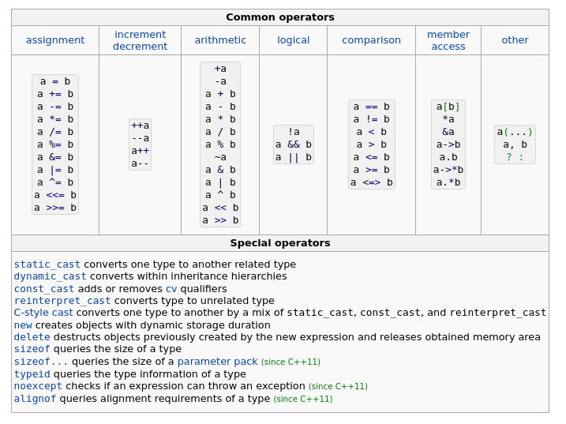

# C++
## Index

01. **[Ad-hoc polymorphism/function overload](#ad-hoc-polymorphismfunction-overload)**
02. **[Operators overload](#operator-overload-sobrecarga-do-operador)**
03. **[Canonical classes](#canonical-classes)**
04. **[Copy constructor](#copy-constructor)**
05. **[Fixed point numbers](#fixed-point-numbers)**
06. **[Resources](#resources)**

## Ad-hoc polymorphism/function overload
- **Ad-hoc polymorphism/sobrecarga de função** é um princípio C++, que permite definir muitas funções com o mesmo nome, mas aceitando parâmetros diferentes.
- Não é apenas para funções de membros de classe, mas também funciona em qualquer função. O princípio é que você tenha um `one-and-only` (um primeiro e único) nome de função, e parâmetros diferentes para cada sobrecarga. Isso permitirá que você especialize o processo de uma função com base em seus parâmetros
- A sobrecarga de função é uma forma de polimorfismo que permite que uma função tenha vários comportamentos.

***Exemplo 1 Sample.hpp***
```cpp
class Sample {
public:
	Sample();
	~Sample();

	/*
	`const` no final da declaracao do metodo indica que o método não modifica
	o estado do objeto ao qual pertence.
	-  Esse const qualifica o método bar como um método constante.
	- Indica que o método bar não pode modificar nenhum membro da instância da
	classe Sample à qual pertence.
	*/
	void bar(char const c) const;
	void bar(int const n) const;
	void bar(float const z) const;
	void bar(Sample const & i) const;
};
```

***Exemplo 2 Sample.cpp***
```cpp
#include <iostream>
#include "Sample.h"

Sample::Sample() {
	std::cout << "Constructor called" << std::endl;
}
Sample::~Sample() {
	std::cout << "Destructor called" << std::endl;
}

void Sample::bar(const char c) const {
	std::cout << "Member function bar called with char overload : " << c << std::endl;
}

void Sample::bar(const int n) const {
	std::cout << "Member function bar called with int overload : " << n << std::endl;
}

void Sample::bar(const float z) const {
	std::cout << "Member function bar called with float overload : " << z << std::endl;
}

void Sample::bar(const Sample & i) const {
	(void) i;
	std::cout << "Member function bar called with Sample class overload" << std::endl;
}
```

***Exemplo 3 main.cpp***
```cpp
#include "Sample.h"

int main() {
	Sample sample;
	float f = 3.14;

	sample.bar(5);
	sample.bar('c');
	sample.bar(f);
	sample.bar(sample);
	return 0;
}
```

***Saída***
```bash
Constructor called
Member function bar called with int overload : 5
Member function bar called with char overload : c
Member function bar called with float overload : 3.14
Member function bar called with Sample class overload
Destructor called
```

## Operator Overload (Sobrecarga do operador)
- A sobrecarga de operadores permite escrever membros de função que permitem que os operadores básicos sejam aplicados a objetos de classe (fonte: Beginning C++). Para fazer isso, você escreve uma função que redefine cada operador que deseja usar com sua classe
- Operadores de grupos em C++:
  - Operadores aritméticos
  - Operadores de atribuição
  - Operadores de comparação
  - Operadores lógicos
  - Operadores bit a bit
- Visão geral dos operadores\
[](./overview_operators.png)
- A sobrecarga de operador permite definir ou alterar o comportamento de um operador em seu programa. Operadores são essencialmente apenas funções.
- C++ oferece controle total sobre a sobrecarga do operador, porém isso pode levar ao mau uso da linguagem. Use apenas a sobrecarga do operador quando fizer todo o sentido.
- A sobrecarga deve estar relacionada à semântica natural do operador. Não são muitos os casos de sobrecarga do operador. **Certifique-se de que haja um bom caso de uso para ele, caso contrário, é fácil cometer erros estúpidos com ele**.

***Exemplo 1 Integer.hpp***
```cpp
#include <iostream>

class Integer {
public:
	Integer(int const n);
	~Integer();

	int getValue() const;

	Integer & operator=(Integer const & rhs); //rhs = right hand side (lado direito)
	Integer operator+(Integer const & rhs) const;

private:
	int _n;
};

std::ostream & operator<<(std::ostream & o, Integer const & rhs);
```

***Exemplo 2 Integer.cpp***
```cpp
#include "integer.h"

Integer::Integer(const int n) : _n(n){
	std::cout << "Constructor called with value " << n << std::endl;
}

Integer::~Integer() {
	std::cout << "Destructor called with value " << this->_n << std::endl;
}

int Integer::getValue() const {
	return this->_n;
}

Integer & Integer::operator=(const Integer &rhs) {
	std::cout << "Assignment operator called from " << this->_n;
	std::cout << " to " << rhs.getValue() << std::endl;

	this->_n = rhs.getValue();

	return *this;
}

Integer Integer::operator+(const Integer &rhs) const {
	std::cout << "Addition operator called with " << this->_n;
	std::cout << " and " << rhs.getValue() << std::endl;

	return Integer(this->_n + rhs.getValue());
}

std::ostream & operator<<(std::ostream & o, Integer const & rhs){
	o << rhs.getValue();
	return o;
}
```

***Exemplo 3 main.cpp***
```cpp
#include "integer.h"
#include <iostream>

int main(){
	Integer x(30);
	Integer y(10);
	Integer z(0);

	std::cout << "Value of x : " << x << std::endl;
	std::cout << "Value of y : " << y << std::endl;
	y = Integer(12);
	std::cout << "Value of y : " << y << std::endl;

	std::cout << "Value of z : " << z << std::endl;
	z = x + y;
	std::cout << "Value of z : " << z << std::endl;

	return 0;
}
```

***Saída***
```bash
Constructor called with value 30
Constructor called with value 10
Constructor called with value 0
Value of x : 30
Value of y : 10
Constructor called with value 12
Assignment operator called from 10 to 12
Destructor called with value 12
Value of y : 12
Value of z : 0
Addition operator called with 30 and 12
Constructor called with value 42
Assignment operator called from 0 to 42
Destructor called with value 42
Value of z : 42
Destructor called with value 42
Destructor called with value 12
Destructor called with value 30
```

## Canonical classes
- Forma canônica inclui:
 - Um construtor padrão
 - Um destruidor padrão
 - Um construtor de cópia
 - Um operador de atribuição

***Exemplo 1 Sample.hpp***
```cpp
#include <iostream>

class Sample {
public:
	Sample(void);								//Canonical form
	Sample(const int n);
	Sample(Sample const & src);					//Canonical form copy constructor
	~Sample(void);								//Canonical form

	Sample & operator=(Sample const & rhs);		//Canonical form

	int getFoo(void) const;

private:
	int _foo;
};

std::ostream & operator<<(std::ostream & o, Sample const & i);
```

***Exemplo 2 Sample.cpp***
```cpp
#include "Sample.h"

Sample::Sample(void) : _foo(0){
	std::cout << "Default constructor called" << std::endl;
}

Sample::Sample(const int n) : _foo(n) {
	std::cout << "Parametric constructor called" << std::endl;
}

Sample::Sample(const Sample &src) {
	std::cout << "Copy constructor called" << std::endl;
	*this = src;
}

Sample::~Sample() {
	std::cout << "Destructor called" << std::endl;
}

Sample &Sample::operator=(const Sample &rhs) {
	std::cout << "Assignment operator called" << std::endl;
	if (this != &rhs)
		this->_foo = rhs.getFoo();
	return *this;
}

std::ostream & operator<<(std::ostream & o, Sample const & rhs){
	o << "The value of _foo is : " << rhs.getFoo();
	return o;
}

int Sample::getFoo(void) const {
	return this->_foo;
}
```

***Exemplo 3 main.cpp***
```cpp
#include "Sample.h"

int main(){
	Sample instance1;
	Sample instance2(42);
	Sample instance3(instance1);

	std::cout << instance1 << std::endl;
	std::cout << instance2 << std::endl;
	std::cout << instance3 << std::endl;

	instance3 = instance2;
	std::cout << instance3 << std::endl;

	return 0;
}
```

***Saída***
```bash
Default constructor called
Parametric constructor called
Copy constructor called
Assignment operator called
The value of _foo is : 0
The value of _foo is : 42
The value of _foo is : 0
Assignment operator called
The value of _foo is : 42
Destructor called
Destructor called
Destructor called
```

## Copy constructor
- **Se uma classe tiver membros de dados que sejam ponteiros, você deverá implementar o construtor de cópia**. Caso contrário, o construtor de cópia padrão copiará um objeto copiando os valores dos membros de dados, o que significa que apenas os endereços dos ponteiros serão copiados - não o que eles apontam.
- O resultado serão dois ou mais objetos com membros apontando para o mesmo objeto. Uma alteração em um objeto apontado por um membro de dados de um objeto afetará todos os objetos duplicados.
- Quando você cria um construtor de cópia, a duplicata pode depender do original.

## Fixed point numbers
- O uso do tipo de dados de ponto fixo é amplamente utilizado em processamento de sinais digitais (DSP) e aplicações de jogos, onde o desempenho às vezes é mais importante que a precisão. A aritmética de ponto fixo é muito mais rápida que a aritmética de ponto flutuante.

- **Ponto binário**: A chave para representar números fracionários é o conceito de ponto binário. Ele atua como um divisor entre o número inteiro e a parte fracionária de um número.

- **Os números de ponto fixo são de fato um parente próximo da representação inteira. Os dois diferem apenas na posição do ponto binário**. Na verdade, você pode até considerar a representação inteira como um "caso especial" de números de ponto fixo, onde o ponto binário está na posição 0. Todas as operações aritméticas que um computador pode operar em números inteiros podem, portanto, ser aplicadas também a números de ponto fixo.

- Portanto, o benefício da aritmética de ponto fixo é que **ela é tão simples e eficiente quanto a aritmética de números inteiros em computadores**. Podemos reutilizar todo o hardware construído para aritmética inteira para realizar aritmética de números reais usando representação de ponto fixo. Em outras palavras, a aritmética de ponto fixo é gratuita nos computadores.

- **A desvantagem do número de ponto fixo é, obviamente, a perda de alcance e precisão quando comparado com as representações de número de ponto flutuante**. Por exemplo, numa representação `fixed<8,1>`, a nossa parte fracionária só é precisa até um quantum de `0.5`. Não podemos representar um número como `0.75`. Podemos representar `0.75` com `fixed<8,2>`, mas perdemos o intervalo na parte inteira.

- **A ideia por trás da aritmética de ponto fixo é que você armazene os valores multiplicados por um determinado valor, use os valores multiplicados para todos os cálculos e divida-os pelo mesmo valor quando desejar o resultado**. O objetivo desta técnica é usar aritmética inteira (int, long...) e ao mesmo tempo ser capaz de representar frações.

```bash
seeeeeeeemmmmmmmmmmmmmmmmmmmmmmm    meaning
31                             0    bit #

s = sign bit, e = exponent, m = mantissa
```

Property | Value for float |	Value for double
---------|-----------------|--------------------
Largest representable number	         | 3.402823466e+38	| 1.7976931348623157e+308
Smallest number without losing precision | 1.175494351e-38	| 2.2250738585072014e-308
Smallest representable number(*)	     | 1.401298464e-45	| 5e-324
Mantissa bits	                         | 23               | 52
Exponent bits	                         | 8	            | 11
Epsilon(**)	                             | 1.1929093e-7	    | 2.220446049250313e-16

- Em resumo, o ponto fixo (fixed point) é uma forma simples, mas muito poderosa, de representar números fracionários no computador. Ao reutilizar todos os circuitos aritméticos inteiros de um computador, a aritmética de ponto fixo é muito mais rápida do que a aritmética de ponto flutuante. Esta é a razão pela qual está sendo usado em muitos aplicativos de jogos e DSP. Por outro lado, falta-lhe o alcance e a precisão que a representação de números de ponto flutuante oferece. Você, como programador ou projetista de circuitos, deve fazer a troca.

## Resources
- [operator overloading reference](https://en.cppreference.com/w/cpp/language/operators)
- [Understanding and Using Floating Point Numbers](https://www.cprogramming.com/tutorial/floating_point/understanding_floating_point.html)
- [Floating point number representation](https://www.cprogramming.com/tutorial/floating_point/understanding_floating_point_representation.html)
- [Printing floating point numbers](https://www.cprogramming.com/tutorial/floating_point/understanding_floating_point_printing.html)
- [Introduction to Fixed Point Number Representation](https://www.geeksforgeeks.org/fixed-point-representation/)
- [Fixed Point Arithmetic in C Programming](https://stackoverflow.com/questions/10067510/fixed-point-arithmetic-in-c-programming)
